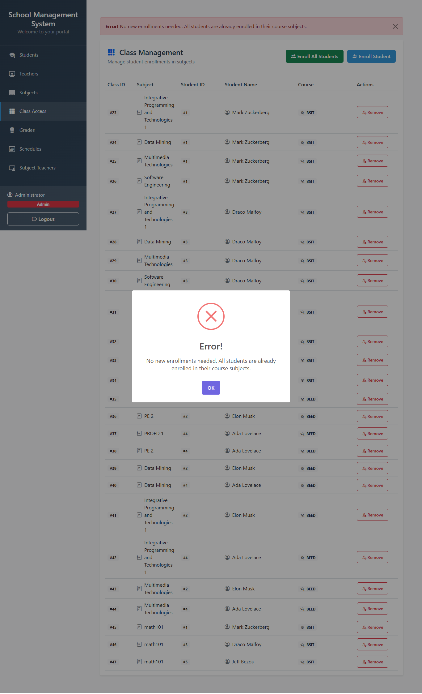
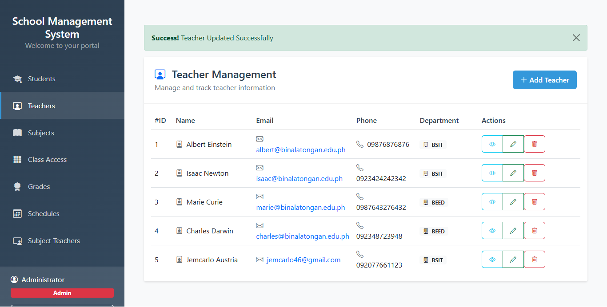
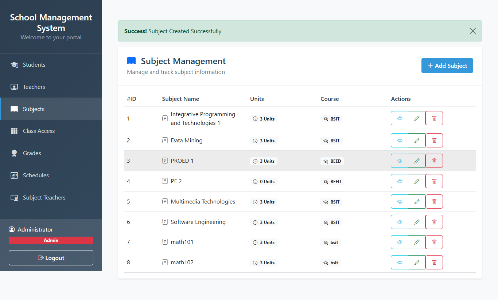

# School Management System

A comprehensive web-based school management system built with PHP and MySQL, featuring student, teacher, subject, and class management capabilities.

## Features

- 👨‍🎓 **Student Management**: Enrollment, profiles, and course registration
- 👨‍🏫 **Teacher Management**: Department assignments and subject allocation
- 📚 **Subject Management**: Course creation and unit configuration
- 📅 **Class Management**: Student-subject mapping and enrollment
- 🎯 **Grade Management**: Record and track student performance

## Quick Start

### Option 1: Automated Setup (Recommended)

1. Ensure you have XAMPP, WAMP, or standalone PHP/MySQL installed
2. Double-click `run.bat` to:
   - Set up the database
   - Import required data
   - Start the development server
   - Open the application in your browser

### Option 2: Manual Setup

Follow our detailed [Setup Guide](setup_guide.md) for step-by-step instructions on:
- System requirements
- Database configuration
- Manual server startup
- Troubleshooting tips

## System Requirements

- PHP 7.3 or higher
- MySQL/MariaDB 5.7 or higher
- Web server (Apache/PHP built-in server)
- Web browser (Chrome/Firefox/Edge)

## Default Login

- Username: admin
- Password: admin123

## Screenshots

### Teacher Management

### Subject Management

### Grade Management

## Releases

The latest version of the School Management System is available in the `releases` directory. Each release includes:

- Complete source code (ZIP archive)
- Pre-configured database
- Installation instructions
- All required files and assets

### Latest Version: v1.0.0 (school-management-system-v1.0.0.zip)

Key features in this release:
- Complete student management system
- Teacher and subject management
- Class scheduling and enrollment
- Grade management and tracking
- Automated setup script (run.bat)
- Comprehensive documentation
- Screenshot examples

## Need Help?

Refer to our [Setup Guide](setup_guide.md) for detailed instructions and troubleshooting tips.